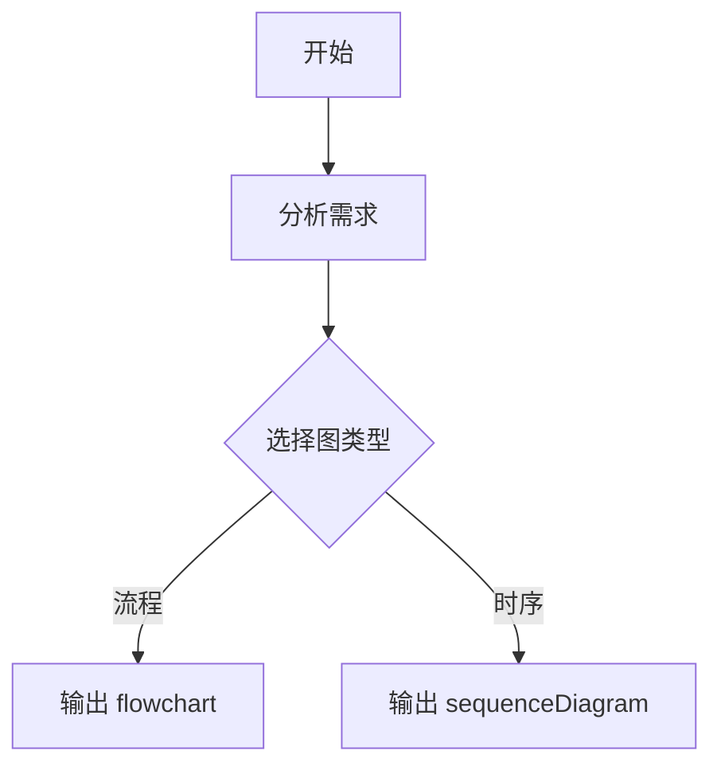

# Mermaid

专门用于把结构、流程、关系和时间顺序整理成 Mermaid 图。

## 设计模式

本 skill 主要采用：
- **Generator**：根据用户需求或现有文本直接生成 Mermaid 图
- **Reviewer**：先判断该用哪种图，再决定是否需要补最小必要信息

## Gotchas

- 不要一上来就默认 `flowchart`，先判断是否更适合时序图、状态图、ER 图或甘特图
- 不要把段落原文整段塞进节点，节点文字要短、可扫描
- 不要为了“信息完整”把一张图画得过满；必要时提醒用户拆成两张图
- 不要输出明显无法渲染的 Mermaid 代码；交付前自查括号、连线、缩进和子图闭合
- 在 `flowchart` 中，如果节点文本里包含 `/plan-ceo-review` 这类带斜杠的字符串，不要写成 `E1[/plan-ceo-review<br/>CEO视角审视产品]`，要写成 `E1["/plan-ceo-review"<br/>CEO视角审视产品]`，否则容易触发语法错误
- 如果用户只说“画个 Mermaid 图”但材料很少，先基于现有信息做一个合理初稿，不要过度追问
- 如果需求本质上是“做一张好看的配图”而不是 Mermaid 语法图，明确说明边界

## 工作流

复制此清单并跟踪进度：

```text
绘图进度：
- [ ] 步骤 1：理解目标
- [ ] 步骤 2：选择图类型
- [ ] 步骤 3：抽取关键节点与关系
- [ ] 步骤 4：生成 Mermaid 代码
- [ ] 步骤 5：自查可读性与语法
- [ ] 步骤 6：交付并说明
```

### Step 1: 理解目标

先判断用户要表达的核心是什么：

- **流程推进**：某件事按步骤如何发生
- **结构分层**：系统、模块、组织或页面如何组成
- **交互时序**：角色或服务之间如何来回通信
- **状态变化**：对象如何在不同状态间切换
- **数据关系**：实体与字段之间如何关联
- **项目安排**：任务、时间、依赖如何分布
- **用户体验路径**：用户在一段旅程中的动作和感受

如果用户给的是文章、方案、PRD、会议纪要或口头描述，先提炼成“节点 + 关系 + 顺序/层级”。

### Step 2: 选择图类型

优先根据表达目标选择图类型。需要时读取 [references/diagram-selection.md](references/diagram-selection.md)。

快速判断：

- 讲步骤和分支：`flowchart`
- 讲服务/角色之间的调用顺序：`sequenceDiagram`
- 讲状态切换：`stateDiagram-v2`
- 讲数据库或业务实体关系：`erDiagram`
- 讲排期、里程碑、依赖：`gantt`
- 讲用户体验过程：`journey`
- 讲对象/模块的静态关系：`classDiagram`
- 讲 git 分支关系：`gitGraph`

如果用户指定了图类型，优先尊重；仅在明显不合适时再说明替代建议。

### Step 3: 抽取关键节点与关系

生成前先做轻量结构化：

- 列出 3 到 9 个关键节点
- 明确节点之间的主关系：顺序、包含、依赖、调用、状态转移、拥有
- 保留主线，删掉次要修饰语
- 给节点命名时优先短中文或稳定英文术语

如果一张图超过 12 个核心节点，优先压缩、分组，或建议拆图。

### Step 4: 生成 Mermaid 代码

默认直接输出 fenced code block，例如：



生成时遵循这些规则：

- 节点 ID 保持简短稳定，如 `A`、`svc_api`、`user`
- 节点文案面向阅读，ID 面向语法，不要混用
- 一张图只表达一个核心问题
- 合理使用子图、注释方向和分组，但不要堆技巧
- 如无特别要求，流程图默认用 `TD`
- 需要强调判断分支时，用菱形条件节点
- 需要强调系统边界时，用 `subgraph`

### Step 5: 自查可读性与语法

交付前至少自查这些点：

- 图类型声明是否正确
- 节点 ID 是否重复
- 连线语法是否闭合
- 文案是否过长
- `flowchart` 节点文本里若包含以 `/` 开头的路径或命令，是否已经用引号包住显示文本
- 是否有无意义的交叉线和重复节点
- 中文内容是否能在 Mermaid 中稳定显示

如果图较复杂，先保证“能渲染 + 看得懂”，再追求细节丰富。

### Step 6: 交付并说明

默认交付内容：

1. Mermaid 代码块
2. 一句说明图表达了什么
3. 如图较复杂，再给一句可选迭代方向

如果用户要求“只给 Mermaid 代码”，就不要附加多余解释。

## 输出要求

- 优先直接输出可复制的 Mermaid fenced code block
- 如用户给了现成文本，必要时先给 1 句“我将其整理为某某图”
- 不要输出大段 Mermaid 教程，除非用户明确要学语法
- 不确定时，先给一个能工作的简洁版本，再说明可继续细化

## 参考资料

- [references/diagram-selection.md](references/diagram-selection.md)：图类型选择和常用骨架
